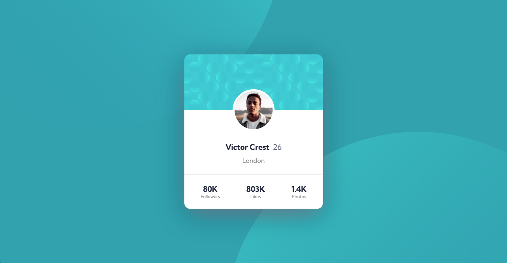

# Frontend Mentor - Profile card component solution

This is a solution to the [Profile card component challenge on Frontend Mentor](https://www.frontendmentor.io/challenges/profile-card-component-cfArpWshJ).

## Table of contents

- [Overview](#overview)
  - [The challenge](#the-challenge)
  - [Screenshot](#screenshot)
  - [Links](#links)
- [My process](#my-process)
  - [Built with](#built-with)
  - [What I learned](#what-i-learned)
  - [Useful resources](#useful-resources)
- [Author](#author)

**Note: Delete this note and update the table of contents based on what sections you keep.**

## Overview

### The challenge

- Build out the project to the designs provided

### Screenshot

### Links

- Solution URL: [Solution](https://www.frontendmentor.io/solutions/profile-card-component-uses-flexbox-pOrJlR1ot)
- Live Site URL: [Live Site](https://chriskorsak.github.io/profile-card-component-main/)

## My process

### Built with

- HTML5
- CSS
- Flexbox

### What I learned

The main challenge for this project was positioning the circular background graphics for both desktop and mobile.

### Useful resources

- [CSS Background Position](https://developer.mozilla.org/en-US/docs/Web/CSS/background-position) - This helped me with positioning the circular background image graphics.

## Author

- Website - [Chris Korsak](https://www.chriskorsak.net)
- Frontend Mentor - [@chriskorsak](https://www.frontendmentor.io/profile/chriskorsak)
